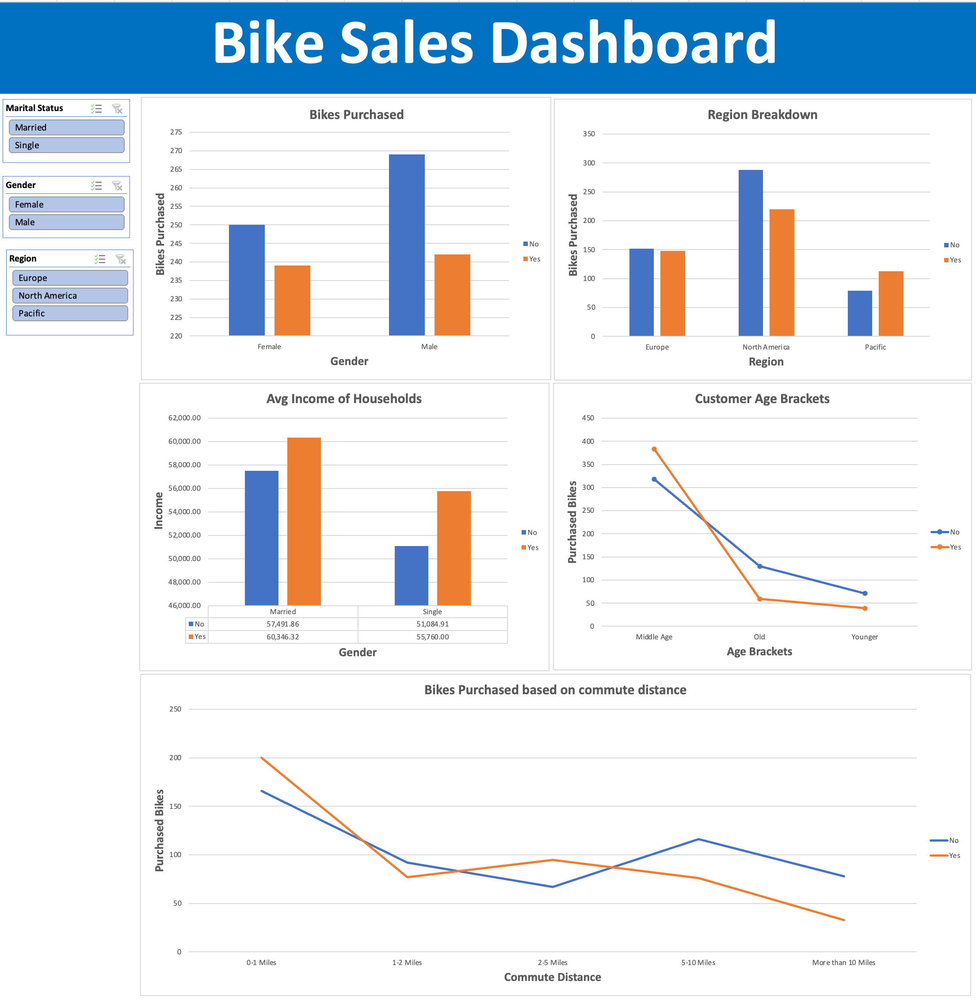

# Bike Buyers Analysis

## Overview

The analysis focuses on understanding the type of customers who purchased bikes and what possible factors could have influenced their purchasing decisions. In this analysis we hope to find :-

- Which gender purchased more bikes?
- Does the marital status have an impact?
- Which age bracket purchased most number of bikes?
- Commuting distance to work?
- Which regions in the world purchased most number of bikes?
- Impact on household income when purchasing a bike?

## Dataset

The dataset utlized in this analysis was from [Alex the data analyst](https://github.com/AlexTheAnalyst/Excel-Tutorial/blob/main/Excel%20Project%20Dataset.xlsx).  
Note: The dataset does not contain which years the data was taken from.

## Preparing the dataset

Once the dataset was downloaded, the following changes were done.

1.  Create 3 new sheets in the excel

    | Sheet Name    | Purpose                                |
    | ------------- | -------------------------------------- |
    | Working_sheet | Took a copy of the raw data sheet.     |
    |               | This is where we wiill do all the work |
    | Pivot         | Design the charts                      |
    | Dashboard     | Create the final dashboards            |

2.  Removed duplicate records in the "Working_Sheet" using excel duplicate removal.
3.  Replaced the values in the following columns
    - Marital Status : Changed "M" to Married ; "S" to Single
    - Gender : Changed "M" to Male; "F" to Female
4.  Grouped the Age column data in to a new column called "Age Bracket".
    - Forumula used - =`"IFS(L2>54,"Old",L2>=31,"Middle Age",L2<31,"Younger")"`

## Dashboard Analysis

 
    The following was concluded at the end of the Analysis:
     

- Which gender purchased more bikes? Male ; The difference between the purchased bikes between both genders were by 3
- Does the marital status have an impact?
- Which age bracket purchased most number of bikes? Middle age
- Commuting distance to work? People travelling 0-1 miles purchased more bikes.
- Which regions in the world purchased most number of bikes? North America
- Impact on household income when purchasing a bike?
